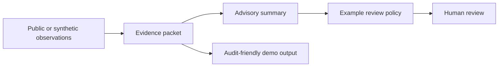

# Architecture overview

Ered Luin's public demonstration shows a simple separation between evidence, advisory interpretation, and human review. The diagram describes the demonstration only; it is not a deployment map.

The public packet interfaces preserve basic provenance and freshness labels. An advisory summary can refer to evidence, while the example policy only illustrates how missing or stale inputs can be surfaced for review. No component in this repository signs, broadcasts, or executes a transaction.

The production implementation and its operational details are maintained separately and are not included here.